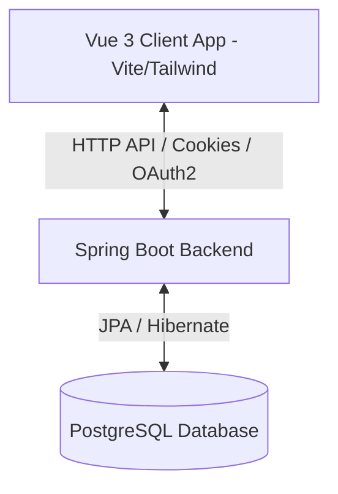
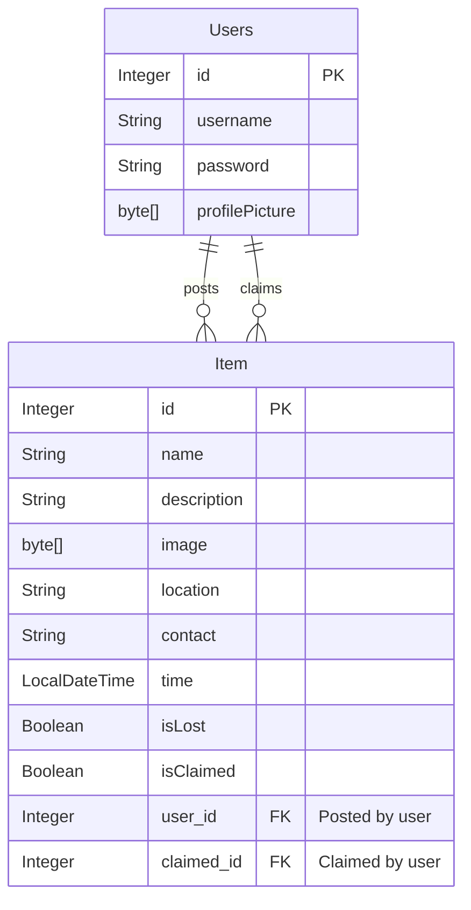

# Product Requirements Document (PRD) - Project "Dibs"

**Product Name:** Dibs  
**Version:** 1.0.0  
**Status:** Draft / Active Review  
**Target Release:** MVP V1  

---

## 1. Executive Summary & Objective

**Dibs** is a modern, collaborative web application designed to simplify the lost-and-found process. The application enables users to report lost or found items, search through existing items, filter by location, and claim items. 

The primary objective of Dibs is to bridge the communication gap between individuals who have lost belongings and those who have found them, providing a secure, real-time, and user-friendly experience.

---

## 2. Product Goals & Objectives

- **Centralize Reports:** Create a single, accessible platform for lost and found items.
- **Secure Interactions:** Ensure user authenticity via local credential security and third-party integrations (Google OAuth2).
- **Fast Discovery:** Provide text-based search and location filtering to help users locate matching records quickly.
- **Accountability:** Track the lifecycle of items (Posted -> Claimed) to prevent multiple false claims.

---

## 3. User Roles & Personas

### 3.1 Reporter (Lost/Found)
- **Action:** Uploads details about an item they either lost or found.
- **Needs:** Quick forms, photo upload, location tags, and clear contact fields.

### 3.2 Claimant
- **Action:** Identifies their lost property from a found listing and claims it.
- **Needs:** Easy lookup, high-quality images, and a clear button to trigger a claim request.

### 3.3 Anonymous Visitor
- **Action:** Browses the homepage and feeds to see if their item is listed.
- **Needs:** Access to search and browse feeds without forced immediate sign-up (optional/read-only).

---

## 4. Functional Requirements

We categorize requirements using the **MoSCoW** framework (Must have, Should have, Could have, Won't have).

### 4.1 Authentication & Profile (Must Have)
- **Local Credentials:** Users can register with a unique username, password, and a profile picture.
- **JWT Authorization:** Secure token-based session management stored in HttpOnly cookies (`jwtoken`).
- **OAuth2 Google Login:** One-click registration/login using Google accounts.
- **User Dashboard:** A dedicated space containing user profile information, profile picture, and lists of user-reported and claimed items.

### 4.2 Item Management (Must Have)
- **Report Item:** A form to list an item (Lost or Found) with details:
  - Name
  - Description
  - Photo (via image upload, max 100MB)
  - Date & Time
  - Location
  - Contact Details
  - Classification (isLost = true/false)
- **Claim Listing:** Allow users to claim items. Once claimed, the item is marked as `isClaimed = true` and linked to the claimant user.
- **Remove Listing:** Authorized deletion of listings by the reporter.

### 4.3 Search & Discovery (Must Have)
- **Separated Feeds:** Distinct views for Lost items and Found items.
- **Query Search:** Real-time text search targeting the item's name/title.
- **Location Filtering:** Filter found items by location name to narrow down searches.

### MoSCoW Feature Matrix

| Feature ID | Feature Group | Description | Priority | Status |
| :--- | :--- | :--- | :--- | :--- |
| **FR-01** | Auth | Local SignUp/SignIn with image uploads | **Must** | Completed |
| **FR-02** | Auth | Google OAuth2 Authentication | **Must** | Completed |
| **FR-03** | Items | Post Lost/Found items with images | **Must** | Completed |
| **FR-04** | Items | View Lost & Found items in distinct feeds | **Must** | Completed |
| **FR-05** | Items | Search items by keyword (name matching) | **Must** | Completed |
| **FR-06** | Items | Filter found items by location | **Must** | Completed |
| **FR-07** | Items | Claim found/lost items | **Must** | Completed |
| **FR-08** | Profile | View user details & claimed items list | **Must** | Completed |
| **FR-09** | Notifications| Real-time alerts when matches are found | *Should* | Backlog |
| **FR-10** | Map | Map visual interface with coordinates pins | *Could* | Backlog |
| **FR-11** | Messaging | In-app chat between finder and owner | *Could* | Backlog |

---

## 5. Technical Architecture

The application uses a decoupled Client-Server architecture.

### 5.1 Technology Stack
- **Frontend:**
  - **Framework:** Vue.js 3 (Composition API)
  - **Styles:** Tailwind CSS v4, DaisyUI v5
  - **Routing & HTTP:** Vue Router 5, Axios
  - **Build System:** Vite
- **Backend:**
  - **Framework:** Spring Boot 3
  - **Security:** Spring Security 6 (JWT Filter & OAuth2 Client)
  - **Data Access:** Spring Data JPA, PostgreSQL Driver
  - **Utility:** Lombok (Data annotations)
- **Database:**
  - **Engine:** PostgreSQL
  - **Image Storage:** Embedded byte arrays (`@Lob` / bytea in PostgreSQL)

### 5.2 Entity Relationship Model
The core database model consists of two entities: `User` and `Item`.

---

## 6. Technical Debt & Outstanding Bugs

During architectural audit of the active code, two issues were identified:

1. **Incorrect JPA Mapping in `User.java`**:
   - *Current Code:* `claimedItems` is mapped by `"user"`, which points to the creator of the item instead of `"user1"` (the claimant).
   - *Refactoring Required:* Change `@OneToMany(mappedBy = "user", ...)` for `claimedItems` in `User.java` to `@OneToMany(mappedBy = "user1", ...)` to ensure correct bi-directional relationships.
2. **NullPointerException Hazard in `JwtFilter.java`**:
   - *Current Code:* `Cookie[] cookies = request.getCookies();` is immediately iterated upon without a null check: `for(Cookie cookie : cookies)`.
   - *Refactoring Required:* Add a null safety guard clause `if (cookies != null)` before iterating.

---

## 7. Non-Functional Requirements

- **Security:** JWTs must be stored with `HttpOnly` enabled to minimize XSS risks.
- **File Upload Limits:** Allowed image upload is set to a maximum of 100MB via `spring.servlet.multipart.max-file-size`.
- **CORS Configuration:** Backend allows credentials and origins explicitly for `http://localhost:5173`.

---

## 8. Future Roadmap

1. **Cloud Blob Storage (AWS S3/MinIO):** Move binary photo data (`byte[] image`) out of the PostgreSQL database and onto a scalable object store to improve database performance and reduce backup sizes.
2. **Real-time Map Search:** Integrate Google Maps or Mapbox APIs to allow users to pin the exact location where they found or lost an item on a map.
3. **Internal Messaging:** Build a simple chat service allowing users to contact each other securely without exposing email addresses or phone numbers.
4. **Match Engine:** Add an automated notification system that emails users when a newly uploaded "found" item matches the description/keywords of their "lost" item.
