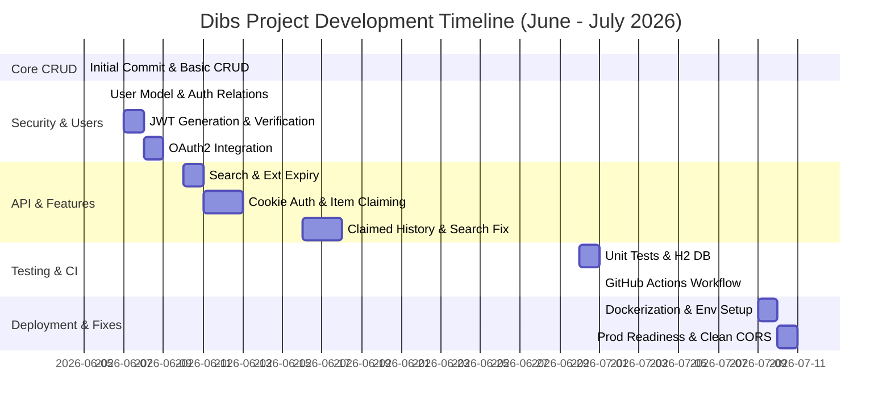

# Project Development Timeline - Dibs

This document presents a comprehensive chronological history and timeline of the Dibs project, reconstructed from all Git commits.

## Development Roadmap

---

## Detailed Development Phases

### Phase 1: Core CRUD & Project Initialization (June 5, 2026)

The project began on June 5, 2026, establishing the foundational codebase for the Dibs application, which is a Spring Boot project.

*   **Initialization**: Configured Maven, Git configurations, wrapper scripts, and initial dependencies in [pom.xml](file:///c:/Projects/spring/Dibs/pom.xml).
*   **Item Resource Management**: Defined the basic data structure for item listings in [Item.java](file:///c:/Projects/spring/Dibs/src/main/java/org/me/dibs/model/Item.java) and implemented persistence using [ItemRepository.java](file:///c:/Projects/spring/Dibs/src/main/java/org/me/dibs/Repository/ItemRepository.java).
*   **CRUD Service & Controller**: Developed business logic in [ItemService.java](file:///c:/Projects/spring/Dibs/src/main/java/org/me/dibs/service/ItemService.java) and exposed REST endpoints via [ItemController.java](file:///c:/Projects/spring/Dibs/src/main/java/org/me/dibs/controller/ItemController.java) to create, read, update, and delete items.

---

### Phase 2: User Security, JWT, & OAuth2 (June 6 - June 9, 2026)

In this phase, the project was secured by introducing user accounts, authorization rules, JWT stateful/stateless authentication, and external login providers.

*   **User Modeling & Relationships**: Introduced the [User.java](file:///c:/Projects/spring/Dibs/src/main/java/org/me/dibs/model/User.java) model and established a relationship where items belong to specific users. Configured Spring Security to control endpoint access.
*   **JWT Integration**: Implemented JWT generation in [JwtService.java](file:///c:/Projects/spring/Dibs/src/main/java/org/me/dibs/service/JwtService.java) and stateless requests interception in [JwtFilter.java](file:///c:/Projects/spring/Dibs/src/main/java/org/me/dibs/config/JwtFilter.java).
*   **OAuth2 Login**: Integrated social login capabilities, persisting OAuth2 authenticated users into the database automatically via [OidcService.java](file:///c:/Projects/spring/Dibs/src/main/java/org/me/dibs/service/OidcService.java).

---

### Phase 3: API Enhancements & Core Features (June 10 - June 18, 2026)

Once security was established, additional business capabilities and UX optimizations were introduced.

*   **Keyword Search**: Added custom search queries to locate items by keywords in [ItemRepository.java](file:///c:/Projects/spring/Dibs/src/main/java/org/me/dibs/Repository/ItemRepository.java).
*   **Cookie Authorization**: Enhanced security and API usability by switching from Header-based bearer tokens to HTTP-only Cookie-based authorization in [JwtFilter.java](file:///c:/Projects/spring/Dibs/src/main/java/org/me/dibs/config/JwtFilter.java) and [userController.java](file:///c:/Projects/spring/Dibs/src/main/java/org/me/dibs/controller/userController.java).
*   **Claiming Functionality**: Built mechanisms to allow users to claim items, tracking claimed history and updating item availability.

---

### Phase 4: Test Infrastructure & Continuous Integration (June 30 - July 1, 2026)

Focus shifted to code quality, testing, and automating validation steps in the repository.

*   **Test Suite**: Created initial unit tests in [ItemServiceTests.java](file:///c:/Projects/spring/Dibs/src/test/java/org/me/dibs/ItemServiceTests.java) using an in-memory H2 database configuration in [application-test.properties](file:///c:/Projects/spring/Dibs/src/test/resources/application-test.properties).
*   **CI Workflow**: Set up a GitHub Actions workflow in `.github/workflows/maven-tests.yaml` to compile code, run tests, and report status on every push. Resolved initial runner executable permissions (`mvnw`).

---

### Phase 5: Deployment Readiness & Production Hardening (July 9 - July 11, 2026)

The final series of commits prepared the application for public cloud deployment (e.g., Render, Docker, PostgreSQL).

*   **Docker Containerization**: Developed a multi-stage [Dockerfile](file:///c:/Projects/spring/Dibs/Dockerfile) targeting Eclipse-Temurin JDK 25 and resolved compilation dependencies for Lombok.
*   **Database Config & Security Policies**: Migrated from H2 to PostgreSQL, added environment placeholder properties, and configured cookies to support cross-site requests in production environments.
*   **CORS Centralization**: Removed inline `@CrossOrigin` annotations, routing all policies through [SecurityConfig.java](file:///c:/Projects/spring/Dibs/src/main/java/org/me/dibs/config/SecurityConfig.java) for clean and secure cross-origin management.
*   **Filter Enhancements**: Began work on additional filtering logic to refine item list responses.

---

## Detailed Commit Log

The following table documents all commits in chronological order (oldest to newest):

| Date | Commit Hash | Author | Description | Primary Files Impacted |
| :--- | :--- | :--- | :--- | :--- |
| 2026-06-05 | `84805c3` | LUCARIO-7 | Initial commit: basic CRUD implemented | [Item.java](file:///c:/Projects/spring/Dibs/src/main/java/org/me/dibs/model/Item.java), [ItemService.java](file:///c:/Projects/spring/Dibs/src/main/java/org/me/dibs/service/ItemService.java), [ItemController.java](file:///c:/Projects/spring/Dibs/src/main/java/org/me/dibs/controller/ItemController.java), [pom.xml](file:///c:/Projects/spring/Dibs/pom.xml) |
| 2026-06-06 | `19e8d3f` | LUCARIO-7 | Users structure and repository added | [User.java](file:///c:/Projects/spring/Dibs/src/main/java/org/me/dibs/model/User.java), [userRepository.java](file:///c:/Projects/spring/Dibs/src/main/java/org/me/dibs/Repository/userRepository.java), [SecurityConfig.java](file:///c:/Projects/spring/Dibs/src/main/java/org/me/dibs/config/SecurityConfig.java) |
| 2026-06-06 | `aa04805` | LUCARIO-7 | Relationship established between users and items | [Item.java](file:///c:/Projects/spring/Dibs/src/main/java/org/me/dibs/model/Item.java), [User.java](file:///c:/Projects/spring/Dibs/src/main/java/org/me/dibs/model/User.java), [userService.java](file:///c:/Projects/spring/Dibs/src/main/java/org/me/dibs/service/userService.java) |
| 2026-06-07 | `8f90d83` | LUCARIO-7 | Users can only see their own items | [ItemRepository.java](file:///c:/Projects/spring/Dibs/src/main/java/org/me/dibs/Repository/ItemRepository.java), [ItemService.java](file:///c:/Projects/spring/Dibs/src/main/java/org/me/dibs/service/ItemService.java) |
| 2026-06-07 | `00146b0` | LUCARIO-7 | JWT token generation added | [JwtService.java](file:///c:/Projects/spring/Dibs/src/main/java/org/me/dibs/service/JwtService.java), [pom.xml](file:///c:/Projects/spring/Dibs/pom.xml) |
| 2026-06-08 | `d89a865` | LUCARIO-7 | Token verification added successfully | [JwtFilter.java](file:///c:/Projects/spring/Dibs/src/main/java/org/me/dibs/config/JwtFilter.java), [SecurityConfig.java](file:///c:/Projects/spring/Dibs/src/main/java/org/me/dibs/config/SecurityConfig.java), [JwtService.java](file:///c:/Projects/spring/Dibs/src/main/java/org/me/dibs/service/JwtService.java) |
| 2026-06-08 | `37a533e` | LUCARIO-7 | Delete local application.properties configuration file | `src/main/resources/application.properties` |
| 2026-06-08 | `3b0de12` | LUCARIO-7 | OAuth2 and normal login configuration | [SecurityConfig.java](file:///c:/Projects/spring/Dibs/src/main/java/org/me/dibs/config/SecurityConfig.java), [pom.xml](file:///c:/Projects/spring/Dibs/pom.xml) |
| 2026-06-09 | `c393e44` | LUCARIO-7 | OAuth2 users are inserted automatically into database | [OidcService.java](file:///c:/Projects/spring/Dibs/src/main/java/org/me/dibs/service/OidcService.java), [SecurityConfig.java](file:///c:/Projects/spring/Dibs/src/main/java/org/me/dibs/config/SecurityConfig.java) |
| 2026-06-09 | `d4c3387` | LUCARIO-7 | Dockerfile added to the project | [Dockerfile](file:///c:/Projects/spring/Dibs/Dockerfile), `.gitignore` |
| 2026-06-10 | `3d32f68` | LUCARIO-7 | Added endpoint for searching items by keyword | [ItemRepository.java](file:///c:/Projects/spring/Dibs/src/main/java/org/me/dibs/Repository/ItemRepository.java), [ItemController.java](file:///c:/Projects/spring/Dibs/src/main/java/org/me/dibs/controller/ItemController.java) |
| 2026-06-11 | `f89555b` | LUCARIO-7 | User details endpoint added, token expiry extended | [JwtService.java](file:///c:/Projects/spring/Dibs/src/main/java/org/me/dibs/service/JwtService.java), [userController.java](file:///c:/Projects/spring/Dibs/src/main/java/org/me/dibs/controller/userController.java) |
| 2026-06-11 | `04706b5` | LUCARIO-7 | Changed authentication header verification to cookie verification | [JwtFilter.java](file:///c:/Projects/spring/Dibs/src/main/java/org/me/dibs/config/JwtFilter.java), [userController.java](file:///c:/Projects/spring/Dibs/src/main/java/org/me/dibs/controller/userController.java) |
| 2026-06-12 | `1c0a447` | LUCARIO-7 | Added new API endpoint and updated access policies | [SecurityConfig.java](file:///c:/Projects/spring/Dibs/src/main/java/org/me/dibs/config/SecurityConfig.java), [ItemController.java](file:///c:/Projects/spring/Dibs/src/main/java/org/me/dibs/controller/ItemController.java) |
| 2026-06-13 | `c45027b` | LUCARIO-7 | Claiming functions and new operations added | [ItemService.java](file:///c:/Projects/spring/Dibs/src/main/java/org/me/dibs/service/ItemService.java), [ItemController.java](file:///c:/Projects/spring/Dibs/src/main/java/org/me/dibs/controller/ItemController.java) |
| 2026-06-13 | `e26fb22` | LUCARIO-7 | Item model fields modified | [Item.java](file:///c:/Projects/spring/Dibs/src/main/java/org/me/dibs/model/Item.java), [ItemService.java](file:///c:/Projects/spring/Dibs/src/main/java/org/me/dibs/service/ItemService.java) |
| 2026-06-16 | `c68dccb` | LUCARIO-7 | Claimed history feature added | [User.java](file:///c:/Projects/spring/Dibs/src/main/java/org/me/dibs/model/User.java), [userController.java](file:///c:/Projects/spring/Dibs/src/main/java/org/me/dibs/controller/userController.java), [ItemService.java](file:///c:/Projects/spring/Dibs/src/main/java/org/me/dibs/service/ItemService.java) |
| 2026-06-18 | `9ea1928` | LUCARIO-7 | Bug fixed in search endpoint | [ItemRepository.java](file:///c:/Projects/spring/Dibs/src/main/java/org/me/dibs/Repository/ItemRepository.java), [ItemService.java](file:///c:/Projects/spring/Dibs/src/main/java/org/me/dibs/service/ItemService.java) |
| 2026-06-30 | `4074516` | LUCARIO-7 | Testing infrastructure and unit tests added | [ItemServiceTests.java](file:///c:/Projects/spring/Dibs/src/test/java/org/me/dibs/ItemServiceTests.java), [pom.xml](file:///c:/Projects/spring/Dibs/pom.xml) |
| 2026-07-01 | `8aa51b8` | LUCARIO-7 | GitHub actions workflow configuration added | `.github/workflows/maven-tests.yaml` |
| 2026-07-01 | `897b6d3` | LUCARIO-7 | Added H2 database configuration dependency for tests | [pom.xml](file:///c:/Projects/spring/Dibs/pom.xml) |
| 2026-07-01 | `d88e890` | LUCARIO-7 | Fixed CI workflow and added test configuration properties | `.github/workflows/maven-tests.yaml`, `src/test/resources/application-test.properties` |
| 2026-07-01 | `d4c5d8d` | LUCARIO-7 | Fixed run command instruction in tests | `.github/workflows/maven-tests.yaml` |
| 2026-07-01 | `a6af8d4` | LUCARIO-7 | Fixed executable script permissions for Maven wrapper | `mvnw` |
| 2026-07-01 | `f9fa601` | LUCARIO-7 | Fixed Maven wrapper script execute configurations | `mvnw` |
| 2026-07-01 | `6303eab` | LUCARIO-7 | Finalized wrapper script execute permissions and test setups | `mvnw`, [ItemServiceTests.java](file:///c:/Projects/spring/Dibs/src/test/java/org/me/dibs/ItemServiceTests.java) |
| 2026-07-09 | `6bc96cc` | LUCARIO-7 | Added user posted elements inside UserController response | [userController.java](file:///c:/Projects/spring/Dibs/src/main/java/org/me/dibs/controller/userController.java) |
| 2026-07-09 | `dd34007` | LUCARIO-7 | Configured dynamic database and cookies for deployment | [SecurityConfig.java](file:///c:/Projects/spring/Dibs/src/main/java/org/me/dibs/config/SecurityConfig.java), [userController.java](file:///c:/Projects/spring/Dibs/src/main/java/org/me/dibs/controller/userController.java) |
| 2026-07-09 | `f5256bf` | LUCARIO-7 | Supported optional profile picture on user registration | [userController.java](file:///c:/Projects/spring/Dibs/src/main/java/org/me/dibs/controller/userController.java), [userService.java](file:///c:/Projects/spring/Dibs/src/main/java/org/me/dibs/service/userService.java) |
| 2026-07-09 | `4ae55f3` | LUCARIO-7 | Fixed NullPointerException in JwtFilter and permitted errors | [JwtFilter.java](file:///c:/Projects/spring/Dibs/src/main/java/org/me/dibs/config/JwtFilter.java), [SecurityConfig.java](file:///c:/Projects/spring/Dibs/src/main/java/org/me/dibs/config/SecurityConfig.java) |
| 2026-07-09 | `d7f5e59` | LUCARIO-7 | Fixed /register 500 error in JwtFilter authentication phase | [JwtFilter.java](file:///c:/Projects/spring/Dibs/src/main/java/org/me/dibs/config/JwtFilter.java) |
| 2026-07-09 | `75130bd` | LUCARIO-7 | Multi-stage Docker build to build application within container | [Dockerfile](file:///c:/Projects/spring/Dibs/Dockerfile) |
| 2026-07-09 | `71eaceb` | LUCARIO-7 | Downgraded Docker JDK to eclipse-temurin:25, set Lombok | [Dockerfile](file:///c:/Projects/spring/Dibs/Dockerfile), [pom.xml](file:///c:/Projects/spring/Dibs/pom.xml) |
| 2026-07-10 | `a97eb36` | LUCARIO-7 | Added application.properties database env placeholders | [application.properties](file:///c:/Projects/spring/Dibs/src/main/resources/application.properties), `.gitignore` |
| 2026-07-10 | `2858710` | LUCARIO-7 | Added explicit PostgreSQL dialect to prevent detection failure | [application.properties](file:///c:/Projects/spring/Dibs/src/main/resources/application.properties) |
| 2026-07-10 | `8fcbf0e` | LUCARIO-7 | Centered CORS configurations in SecurityConfig (removed inline) | [ItemController.java](file:///c:/Projects/spring/Dibs/src/main/java/org/me/dibs/controller/ItemController.java), [userController.java](file:///c:/Projects/spring/Dibs/src/main/java/org/me/dibs/controller/userController.java) |
| 2026-07-11 | `2c1d097` | LUCARIO-7 | Implemented work-in-progress filtering logic | [ItemRepository.java](file:///c:/Projects/spring/Dibs/src/main/java/org/me/dibs/Repository/ItemRepository.java), [ItemService.java](file:///c:/Projects/spring/Dibs/src/main/java/org/me/dibs/service/ItemService.java), [application.properties](file:///c:/Projects/spring/Dibs/src/main/resources/application.properties) |
